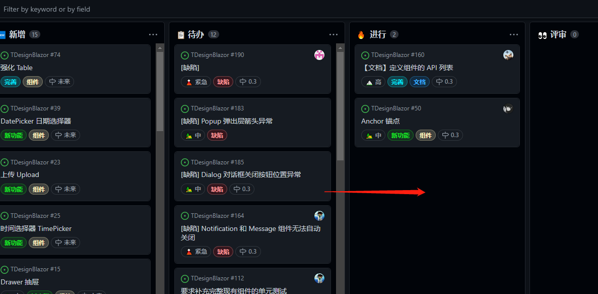
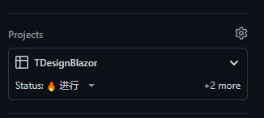

# 项目贡献指南

:blush: 首先感谢你愿意参与到项目的贡献中，我们为你的勇气感到非常的开心，这本身就是一件值得尊敬的事情 :+1:

不过在开始贡献宝贵代码之前，请先暂停一下，花几分钟时间阅读本指南，它是我们贡献者共同遵守的规范。

> #### 写在最前面（序）
> * 要记住，你不是码农，你是一名非常合格的软件工程师，代码不过是我们的基本技能而已，但是，这是我们花了时间倾注的心血，是我们的灵魂，是践行了脚踏实地完成目标和梦想的那个人，所以任何人写的每一行代码都值得尊敬。
> * 我相信你吐槽过各式各样的代码，因为我也是 :smile: 这就是我们技术人的风格。但是，换个角度来想，我们都是希望项目能继续维系它的生命，这也是我们吐槽的原因之一，不是吗 :stuck_out_tongue_winking_eye: 因此，代码规范就显得尤为重要了。
> * 我希望任何贡献者都能具备【利他精神】，这样的精神不言而喻，我们不是一个人在战斗，但是只有齐心协力才会获得最终的胜利。
> * 任何一个组织，哪怕再小，也得有自己的规矩，俗话说【无规矩不成方圆】，当然我们具备开放的态度，可以尽情的吐槽，不过请记住**任何时候都请尊重他人。**

### 行为准则（Code of Conduct)
这个项目和参与其中的每个人都受[行为准则](CodeOfConduct.md)的约束。

### 关于技术问题
对于项目贡献相关的技术问题，你可以直接联系贡献者团队或其他的常规技术询问站点：

* 创始人邮箱： [william-zzh@outlook.com](mailto:william-zzh@outlook.com)
* QQ群：1012762441
* 微信群：TDesignBlazor 组件交流
* [StackOverflow](http://www.stackoverflow.com)
* [谷歌](http://www.google.com)
* [微软文档](https://learn.microsoft.com/zh-cn/aspnet/core/blazor/)

**请不要使用 Github Issue**

>因为这是留给用户对本项目的使用反馈，比如缺陷报告、新功能、新点子搜集的地方。

### 缺陷（BUG）
如果你在源代码中发现了一个错误，你可以通过向我们的 GitHub 库提交一个问题]()来帮助我们。更好的是，您可以提交一个带有修复程序的 Pull Request。

### 功能（Feature）
你可以通过向我们的 GitHub 库提交一个问题来请求一个新功能。如果你想实现一个新功能，请提交一个使用场景的问题，使它易于使用。也请考虑它是什么样的变化:

* 对于一个主要功能，首先打开一个问题，并概述你的建议，以便讨论。这也将允许我们更好地协调我们的工作，防止工作的重复，并帮助您精心设计变更，以便它被成功地接受到项目中。
* 小的功能可以被制作和直接提交作为一个拉请求。

## 提交指南（Submit Issue）
#### 分支管理
> 如果你是通过 fork 形式提交分支，请跳过此约束，并遵守 PR 规范

**如果你还没有成为贡献者，需要通过联系方式通知仓库所有者将你添加到贡献者名单中**


项目采用【主干发布，分支开发】的方式，即 **master** 作为主干分支，并且每个版本以 **tag** 的形式打在该分支上。

**分支开发流程**
1. 拉取 master 分支获取最新代码
2. 基于 master 分支创建开发分支
3. 提交 Pull Request 到 master 分支
4. 等待代码评审或修改提出的评审
5. 达到完工标准（DoD)后合并到主分支

**开发分支命名**
开发分支将采用二级域格式，即 `[type]/[scope]/[分支名称]` 的格式：

* type 分支类型：
  * feature 功能分支：新功能、更新、优化等
  * bugfix 缺陷分支：仅适用于修复 BUG
* scope 范围：
  * component：组件
  * doc：文档
  * test：测试
  * refactor：重构
  * ci：持续集成
  * extension：扩展
  * other：其他
* 分支名称：使用简短且和本次提交的内容相关的短语，多个单词使用下划线，例如 `update_button_theme`

举例：
* 和组件相关的功能分支：`feature/component/update_progress_namespacing`
* 重构文档：`feature/doc/add_button_doc`
* 某个组件的 bug 修复：`bugfix/component/fix_menu_dropdown_has_empty`
* 新增单元测试：`feature/test/add_button_ut`

> 一个分支只做一件事情，请不要将多件事情同时在一个分支里做。

#### 实时看板
我们采用[实时看板](https://github.com/users/AchievedOwner/projects/4/)展示最直观的进度和工作量，并公开给所有用户。

当贡献者领取了 Issue 后，请在适当的时候更新任务的实施状态：

* 在看板中进行拖动 Issue 到相应列
    

* 在 Issue 详情中更新字段

    

#### 提交记录
请在每一次提交的内容中写出本次提交的内容摘要，这将导致在查看项目历史记录时更容易理解的可读消息。同时，我们使用git提交消息来生成更新日志。

> 提交规范要求符合：[https://www.conventionalcommits.org/zh-hans/v1.0.0/](https://www.conventionalcommits.org/zh-hans/v1.0.0/)

**PR 会自动对提交记录进行检查**


#### 合并请求（Pull Request）
当你分支开发完成后，推送到服务器上，然后请提交【合并请求（Pull Request）】，简称 **PR(日后将使用简称代替）**。但是在提交之前，请先到遵守以下规范：
* 在 [Github](https://github.com/AchievedOwner/TDesignBlazor/pulls) 上先搜索是否出现过重复或类似的合并请求，即使已经被关闭了，以避免重复性工作；
* 符合[代码规范](#代码规范)的定义；
* 要合并的分支符合[分支命名约定](#分支管理)；
* 使用遵循[提交消息约定](#提交记录)的描述性提交消息提交更改。遵守这些约定是必要的，因为发布说明是根据这些消息自动生成的；
  ```bash
  git commit -a
  ```
  **注意：** 可选的 `commit -a` 命令行选项将自动 “添加” 和 “rm” 编辑过的文件。
* 必要的持续集成（CI）已经完成并通过；
* 根据 PR 模板，完善信息；

> PR 标题请采用[语义化提交规范](https://www.conventionalcommits.org/zh-hans/v1.0.0/)并会在 CI 中校验

**合并需要时间阅读代码、验证并讨论，请保持耐心**

## 代码规范
为了确保整个源代码的一致性，在工作时请记住以下规则：
* 要求代码符合 C# 代码规范，参考[https://github.com/dotnet/runtime/blob/main/docs/coding-guidelines/coding-style.md](https://github.com/dotnet/runtime/blob/main/docs/coding-guidelines/coding-style.md) 和 [微软官方 C# 编码约定](https://learn.microsoft.com/zh-cn/dotnet/csharp/fundamentals/coding-style/identifier-names)
* 完整且清晰的注释，要求组件的参数、暴露的 public、protected 方法都必须使用 `<summary>...</summary>` 进行描述。

## 组件开发规范
* 组件名称要以 **“T”** 字母作为开头，例如 `TButton`、`TTable`、`TTab`、`TInputText` 等，以最大限度避免与其他组件的命名出现冲突（项目中可能会有多个组件框架出现）
  > 如何判断是组件类？组件类必须继承 `TDesignComponentBase` 以及会以 `TDesignComponentBase` 结尾的组件基类。
* 可输入组件要以 `Input` 开头，例如 `TInputText`、`TInputCheckBox`
* 分组或容器组件以 `Group` 或 `Container` 作为后缀命名，如 `TAvatarGroup`、`TInputGroup`
* 组件的参数名称，尽可能与官方定义的组件名称保持一致
* 可选参数优先使用枚举进行定义
* 若一个参数可具备多种数据类型，请使用 `OneOf<>` 类型，例如 `OneOf<int, (int,int)>`
* 必须编写组件的单元测试，目前总体覆盖了目标是 **20%**

## 第三方库
项目中使用了一些第三方库来帮助我们完善某些功能的开发，请确保这些库是可以被直接使用的，项目的作者有权取消使用该类库以避免不必要的版权纠纷。

鼓励贡献者提供更好的第三方库以提升开发效率，但是**必须是开源项目**

**如果贡献者在 PR 中提交了新的第三方库，请一定要有充足的说明，并且提供开源仓库的地址**

目前用到的第三方库：
* [ComponentBuilder](https://github.com/AchievedOwner/ComponentBuilder)：由作者亲自维护，并持续保持更新；
* [OneOf](https://github.com/mcintyre321/OneOf)

> 文档将不定期更新，请随时关注。